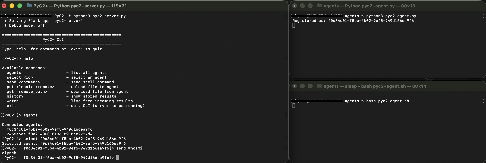

# PyC2+

PyC2+ is a Python-based Command and Control (C2) framework
designed for education and red team operations. It provides a central server with an interactive CLI and
a set of cross-platform agent payloads.

------------------------------------------------------------------------



## Features

### **Multi-Agent Support**

-   Automatically registers agents on connection via `/register`.
-   Maintains independent task queues and result logs per agent.
-   Allows operator to select and control agents individually.

### **Cross-Platform Payloads**

Agent payloads are stored in the `agents/` directory and include: 
- **Python agent (`pyc2+agent.py`)** 
- **PowerShell agent (`pyc2+agent.ps1`)** 
- **Bash agent (`pyc2+agent.sh`)**

This ensures compatibility across Windows, Linux, and macOS.

### **Polling Interval**

Each agent script includes a configurable polling interval that controls how frequently the agent checks in with the server for new tasks. You can adjust this value directly within the script to suit your use case:

- **Faster polling (1–2 seconds)**: Useful for lab testing, immediate response.

- **Standard polling (5–30 seconds)**: More typical for general beaconing behavior.

- **Slow polling (1+ minutes)**: Suitable for long‑running, low‑frequency tasking.

### **REST API Backend (Flask Based)**

The server utilises REST endpoints for: 
- Agent registration
- Task delivery
- Result ingestion
- File uploads/downloads
- Historical result retrieval

### **Tasking System**

Supports sending: 
- Arbitrary shell commands
- File uploads (`put`)
- File downloads (`get`)

Tasks are stored in a queue on the server and delivered to each agent when it polls. If an agent is offline, pending tasks remain in the queue and are executed once the agent reconnects.

### **File Transfer**

-   **PUT:** Server → Agent file upload
-   **GET:** Agent → Server file download

### **Result Logging**

-   Results are timestamped and stored in `history`.
-   Supports live monitoring using `watch` inside the CLI.
-   Downloaded files are stored in agent‑specific folders inside the attacker's Downloads directory, with the server automatically detecting the correct OS path.

### **Operator CLI**

The integrated CLI provides: 
- Agent listing (`agents`) 
- Agent selection (`select`) 
- File upload/download (`put`, `get`) 
- Command execution (`send`) 
- Historical output (`history`) 
- Live result feed(`watch`) 
- Local command output preview

### **Authentication**

All agent/server communication uses a simple bearer token
(`MySecretKey123`). 
**Improved auth system in development**

### **Local Command Execution**

When sending commands from the CLI using `send`, the server instructs the
agent to execute the command locally. Output is displayed in the server CLI, and results saved in `history`.

------------------------------------------------------------------------

## Requirements

```
pip install Flask
```

```
pip install requests
```

See `requirements.txt`.

------------------------------------------------------------------------

### **Usage**

Set the `C2_SERVER_IP` value in each agent script so it points to your attacker (server) machine.

Start the C2 server on the attacker system:
```
python3 pyc2+server.py
```

Execute the desired agent payload (`.py`, `.ps1`, or `.sh`) on the victim machine:
```
python3 pyc2+agent.py
```
OR
```
powershell -ExecutionPolicy Bypass -File pyc2+agent.ps1
```
OR
```
bash pyc2+agent.sh
```

Use the `agents` command to get a list of agentIDs.

Use the `select {agentID}` command to start a session with the victim/agent. 

------------------------------------------------------------------------

PyC2+ is strictly intended for authorized testing, research, and education only.
