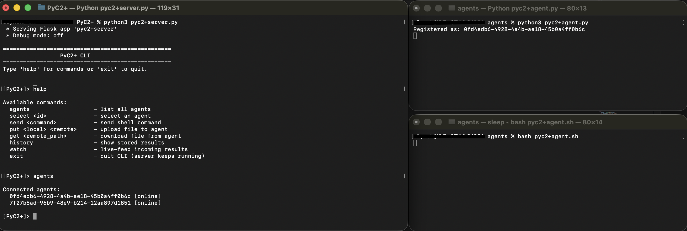

# PyC2+

PyC2+ is a modular Python-based Command and Control (C2) framework
designed for education and red team operations. It provides a central
server, REST API backend, interactive operator CLI, and various
agent payloads.

------------------------------------------------------------------------



## Features

### **Modular Architecture**

The project is split across multiple Python modules: 
- `server.py` -- Entry point; runs Flask server + CLI thread
- `routes.py` -- Flask REST API endpoints
- `cli.py` -- Operator command-line interface
- `utils.py` -- Helper utilities
- `configs.py` -- C2 configs and data in-memory data storage

------------------------------------------------------------------------

### **Multi-Agent Support**

-   Agents auto-register via `/register`
-   Unique agent IDs
-   Tracks `last_seen`
-   Independent queues + history logs

### **Agents Payloads**

Stored in `agents/`: 
- Python (`pyc2+agent.py`) 
- PowerShell (`pyc2+agent.ps1`) 
- Bash (`pyc2+agent.sh`)

------------------------------------------------------------------------

### **Polling System**

Agents beacon at configurable intervals. Intervals can be modified in `configs.py`. Set to 10s as default.

------------------------------------------------------------------------

### **REST API Backend**

Includes: 
- `/register` 
- `/task/<agent_id>`
- `/result/<agent_id>` 
- `/agents` 
- `/history/<agent_id>`

------------------------------------------------------------------------

### **Tasking + File Transfer**

Supports: 
- Shell commands
- File uploads (**put**)
- File downloads (**get**)

Downloaded files go users default Downloads folder.

------------------------------------------------------------------------

### **Result Logging**

-   Timestamped results
-   CLI `history` + live output `watch` supported

------------------------------------------------------------------------

### **Operator CLI**

Commands: 
- `agents` 
- `select <id>` 
- `send <cmd>` 
- `put <local> <remote>` 
- `get <remote>` 
- `history` 
- `watch`

------------------------------------------------------------------------

### **Authentication**

Currently uses a hardcoded bearer token in `configs.py`.
Improved token generation and handling in development.

------------------------------------------------------------------------

## Project Structure

    PyC2+/
    ├── server.py
    ├── routes.py
    ├── cli.py
    ├── utils.py
    ├── storage.py
    └── agents/
        └── agent.py
        └── agent.ps1
        └── agent.sh
        
------------------------------------------------------------------------

## Requirements

    pip install Flask
    pip install requests

------------------------------------------------------------------------

### **Usage**

Set the `C2_SERVER_IP` value in each agent script so it points to your attacker (server) machine.

Start the C2 server on the attacker system:
```
python3 pyc2+server.py
```

Execute the desired agent payload (`.py`, `.ps1`, or `.sh`) on the victim machine:
```
python3 agent.py
```
OR
```
powershell -ExecutionPolicy Bypass -File agent.ps1
```
OR
```
bash agent.sh
```

Use the `agents` command to get a list of agentIDs.

Use the `select {agentID}` command to start a session with the victim/agent. 

------------------------------------------------------------------------

PyC2+ is strictly intended for authorized testing, research, and education only.
